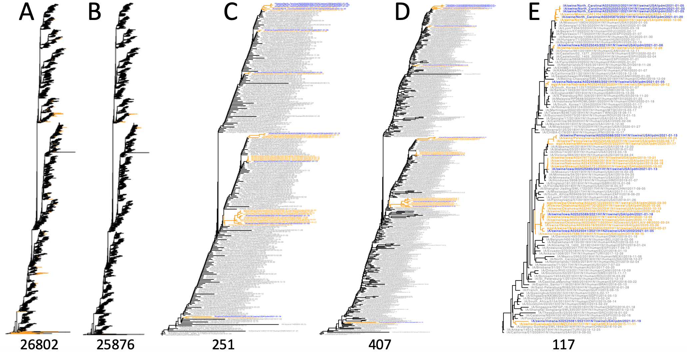

# smot - Simple Manipulation Of Trees

`smot` is a command line tool for manipulating, summarizing, and sampling from
phylogenetic trees.


 | subcommand | description                                      |
 | ---------- | ------------------------------------------------ |
 | convert    | convert tree format                              |
 | tips       | list tip labels                                  |
 | plot       | plot the tree                                    |
 | sample     | sub-sample a tree                                |
 | factor     | integrate and/or infer classes for tips          |
 | tipsed     | regex-based search and replace across tip labels |
 | midpoint   | root tree by midpoint                            |
 | random     | make random tree given list of tip labels        |
 | clean      | remove singleton nodes and ladderize             |


## Installation

``` sh
pip install smot
```

## Requirements

Python modules:
 * biopython
 * parsec
 * docopt

Python v3.6 and later (required for string interpolation)

## Documentation

You can access usage information from the command line:

```
$ smot -h
Usage: smot [OPTIONS] COMMAND [ARGS]...

  Simple Manipulation Of Trees

Options:
  -v, --version  Show the version and exit.
  -h, --help     Show this message and exit.

Commands:
  color   Color the tips or branches.
  factor  Impute, annotate with, and/or tabulate factors.
  filter  An advanced tool for performaing actions (remove, color, sample,...
  grep    Prune a tree to preserve only the tips with that match a pattern.
  sample  Subsample the tree using various methods.
  stat    Display statistics for an input tree
  tips    Print the tree tip labels.
  tipsed  Search and replace patterns in tip labels.
```

Detailed information can then be requested for the specific subcommand:

```
$ smot grep -h
Usage: smot grep [OPTIONS] PATTERN [TREE]

  Prune a tree to preserve only the tips with that match a pattern.

Options:
  -v, --invert-match  Keep all leafs NOT matching the pattern
  -P, --perl          Interpret the pattern as a regular expression
  -f, --file          Read patterns from a file instead of a set string
  --newick            Write output in simple newick format (tip colors and
                      metadata will be lost)

  -h, --help          Show this message and exit.
```


## Examples

### Example 1

Starting from the influenza A virus in pandemic tree, three subsamples can be
drawn and colored as follows:

```sh
smot grep -v "(swine|human)" pdm.tre |
    smot filter --factor-by-capture="(swine|human)" --all-match="swine" --none-match="2021-" --remove |
    smot filter --factor-by-capture="(swine|human)" --all-match="swine" --smaller-than 2 --remove |
    smot color rm |
    smot filter --factor-by-capture="(swine|human)" --all-match="swine" --color="#FFA000" |
    smot color leaf -P -p "." "#909090" -p "swine" "#FFA000" -p "swine.*2021-" "#0000FF" > select-swine.tre

smot sample equal select-swine.tre --factor-by-capture="(swine|human)" \
  --max-tips=1 --keep="swine" > select-swine-equal-sample.tre

smot sample mono select-swine.tre --scale=4 --factor-by-capture="(swine|human)" \
  --min-tips=1 --keep="swine" --seed=42 > select-swine-mono-sample.tre

smot sample para select-swine.tre --scale=4 --factor-by-capture="(swine|human)" \
  --min-tips=3 --keep="swine" --seed=42 > select-swine-para-sample.tre
```

Line 1 filters out all leaves with hosts other than swine or human. Line 2 removes all monophyletic swine clades that have no representative from 2021. Line 3 removes all swine clades represented by a single member. Line 4 removes any coloring in the input tree. Lines 5 colors all remaining swine clades orange (hexadecimal code “#FFA000”). Line 6 colors leaves gray by default, then colors swine orange and finally recent swine blue. Lines 8-9, 10-11, and 14-15 downsamples the human representatives using the equal, mono, and para algorithms, respectively. This script is based on smot v0.14.2, the API may change in the future.



In the above figure, (A) is the unsampled tree with all human (black) and swine
(orange) pandemic strains, (B) removes all monophyletic swine branches that
have only a single representative, and (C-E) subsample tree B using the
*equal*, *mono* and *para* algorithms.

### Example 2


``` sh
# image B
smot sample equal --factor-by-capture="(human|swine)" --keep="swine" --seed=42 --max-tips=2 pdm.tre > pdm-equal.tre
# image C
smot sample prop --proportion=0.1 --min-tips=2 --factor-by-capture="(human|swine)" --keep="swine" --seed=42 pdm.tre > pdm-prop.tre
# image D
smot sample para --proportion=0.1 --min-tips=2 --factor-by-capture="(human|swine)" --keep="swine" --seed=42 pdm.tre > pdm-para.tre
```

