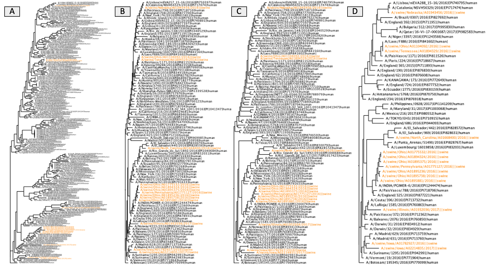

[](https://travis-ci.org/flu-crew/smot)


# smot - Simple Manipulation Of Trees

`smot` is a command line tool for manipulating, summarizing, and sampling from
phylogenetic trees.


 | subcommand | description                                      |
 | ---------- | ------------------------------------------------ |
 | convert    | convert tree format                              |
 | tips       | list tip labels                                  |
 | plot       | plot the tree                                    |
 | sample     | sub-sample a tree                                |
 | factor     | integrate and/or infer classes for tips          |
 | tipsed     | regex-based search and replace across tip labels |
 | midpoint   | root tree by midpoint                            |
 | random     | make random tree given list of tip labels        |
 | clean      | remove singleton nodes and ladderize             |


## Installation

``` sh
pip install smot
```

## Requirements

Python modules:
 * biopython
 * parsec
 * docopt

Python v3.6 and later (required for string interpolation)

## Examples

Accessing usage information for each subcommand:

``` sh
smot -h
```




``` sh
# image B
smot sample equal --factor-by-capture="(human|swine)" --keep="swine" --seed=42 --max-tips=2 pdm.tre > pdm-equal.tre
# image C
smot sample prop --proportion=0.1 --min-tips=2 --factor-by-capture="(human|swine)" --keep="swine" --seed=42 pdm.tre > pdm-prop.tre
# image D
smot sample para --proportion=0.1 --min-tips=2 --factor-by-capture="(human|swine)" --keep="swine" --seed=42 pdm.tre > pdm-para.tre
```
